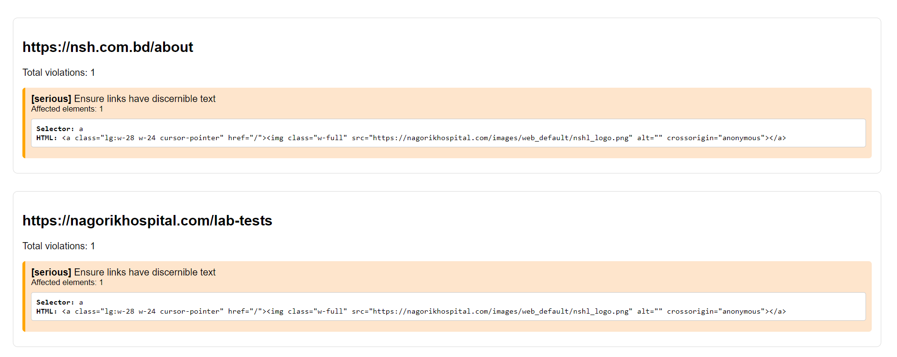
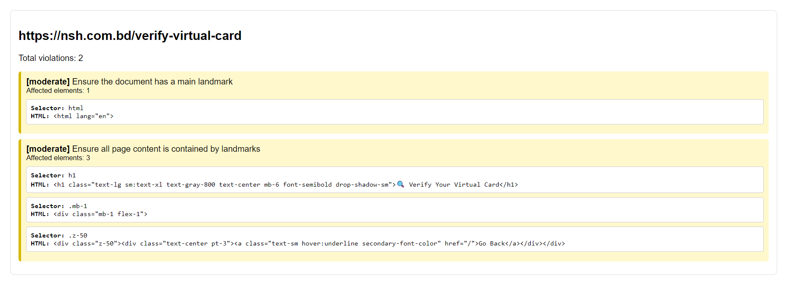
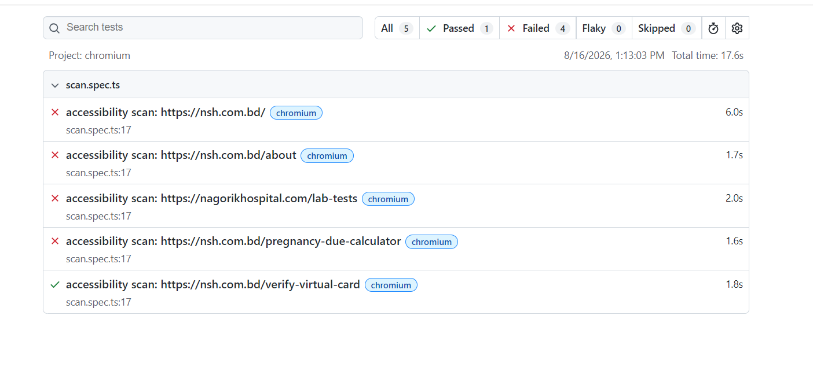

# Accessibility Audit Tool

An automated accessibility testing tool built with Playwright and axe-core, designed to scan websites for WCAG accessibility violations and generate a detailed, color-coded HTML report.

## Table of Contents
- [Features](#features)
- [Why I Built This](#why-i-built-this)
- [Tech Stack](#tech-stack)
- [Setup](#setup)
- [Usage](#usage)
- [Sample Report](#sample-report)
- [Test Results (Pass/Fail)](#test-results-passfail)
- [Sample Finding](#sample-finding)
- [Future Improvements](#future-improvements)

## Features

- Scans one or multiple websites/pages for accessibility violations
- Uses [axe-core](https://github.com/dequelabs/axe-core), an industry-standard accessibility testing engine
- Generates a human-readable HTML report showing:
  - Violation severity (critical, serious, moderate, minor)
  - Affected element selectors
  - Raw HTML of the affected elements
- Uses assertion-based pass/fail logic — automatically fails any page with `critical`/`serious` violations, while allowing `minor`/`moderate` issues through (risk-based testing, suitable for CI/CD build gates)
- Built with Playwright + TypeScript

## Why I Built This

As part of learning Playwright for QA automation, I wanted to go beyond basic UI testing and explore how automated tools can catch real accessibility issues. I tested this tool against a live production website and found genuine, actionable accessibility bugs — including a site-wide issue where a logo link lacked accessible text across multiple pages.

## Tech Stack

- [Playwright](https://playwright.dev/) — browser automation
- [@axe-core/playwright](https://github.com/dequelabs/axe-core-npm) — accessibility scanning engine
- TypeScript

## Setup

1. Clone this repository
   ```bash
   git clone <your-repo-url>
   cd accessibility-audit-tool
   ```

2. Install dependencies
   ```bash
   npm install
   ```

3. Install Playwright browsers
   ```bash
   npx playwright install
   ```

## Usage

1. Open `tests/scan.spec.ts` and edit the `websitesToScan` array with the URLs you want to test:
   ```typescript
   const websitesToScan = [
     'https://example.com',
     'https://example.com/about',
   ];
   ```

2. Run the scan
   ```bash
   npx playwright test scan.spec.ts --project=chromium --workers=1
   ```

3. Open the generated report
   ```
   accessibility-report.html
   ```

**Note:** This tool uses assertion-based pass/fail logic — any page with `critical` or `serious` severity violations will cause the test to fail, while `minor`/`moderate` violations are allowed to pass. This is intentional and mirrors how the tool would behave as a CI/CD build gate, rather than just generating a passive report.

## Sample Report

The report shows violations grouped by page, with severity-based color coding and exact HTML selectors for each issue.





## Test Results (Pass/Fail)

The scanner doesn't just report violations — it uses assertions to automatically fail any page containing `critical` or `serious` severity violations, while allowing `minor`/`moderate` issues to pass. This makes it suitable for CI/CD pipelines as a build gate.



In this run, 4 out of 5 pages failed due to serious accessibility issues, while one page passed because it only had moderate-severity violations.

## Sample Finding

While testing against a real hospital website, this tool identified a recurring issue across multiple pages: a logo link with no discernible text for screen readers (`alt=""` on the only child image). Because the logo appears in the shared site header, this single fix would resolve the accessibility gap site-wide — a good example of how automated scanning can surface high-impact, low-effort fixes.

## Future Improvements

- [x] Add assertion-based pass/fail logic for critical/serious violations
- [x] Add error handling for unreachable pages and timeouts
- [x] Move hardcoded URLs into a config file or CLI argument
- [ ] Add CI/CD integration (GitHub Actions) for scheduled scans
- [ ] Add support for scanning an entire sitemap automatically
- [ ] Group and highlight duplicate violations across pages
- [ ] Export reports in JSON/CSV for further analysis
